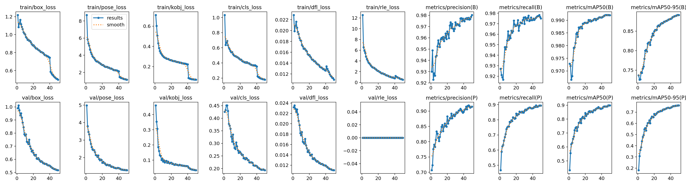

# Hand Pose Estimation Lab Analysis

### 1. Hardware Profiling & Resource Metrics
* Allocated Target Computing Device: Local NVIDIA GeForce RTX 5050 Laptop GPU (CUDA)
* Configured Execution Batch Size: `batch=16`
* Absolute Processing Duration Spent Per Epoch: approximately 10 minutes 23 seconds on average (31,129.6 seconds total across 50 epochs)

### 2. Performance Tracking Metrics Ledger (Best Validated Checkpoint)
* Overall Training Budget Epochs Completed: Epoch 50/50
* Box Loss (box_loss): 0.51811 (validation, Epoch 49)
* Pose Loss (pose_loss): 1.28479 (validation, Epoch 49)
* Class Loss (cls_loss): 0.19451 (validation, Epoch 49)
* Tracking Precision Score (Pose mAP50): 0.89830
* Rigorous Generalization Bound Score (Pose mAP50-95): 0.76023

### 3. Optimization and Loss Landscape Analysis

* **Critical Evaluation Reflection**: The validation losses continued improving through the final stage of training rather than showing a clear rebound. The minimum validation box loss (0.51700), validation pose loss (1.28261), and validation class loss (0.19362) were all reached at Epoch 50. Therefore, the minimum point occurred at the final epoch, and there was no clear evidence of overfitting within the allocated training budget. The model completed the full 50/50 epochs and did not trigger early stopping; the configured patience was 100 epochs, which was greater than the total training budget. The run used Ultralytics automatic optimizer selection (`optimizer=auto`) with the standard non-cosine learning-rate schedule (`cos_lr=False`). The configured loss weighting emphasized pose localization (`pose=12.0`) more strongly than box localization (`box=7.5`) and classification (`cls=0.5`). This prioritization was appropriate for the hand-joint tracking objective. By the end of training, the model achieved a Pose mAP50 of approximately 0.898 and a Pose mAP50-95 of approximately 0.760, indicating strong keypoint tracking performance after fine-tuning compared with the pretrained baseline.